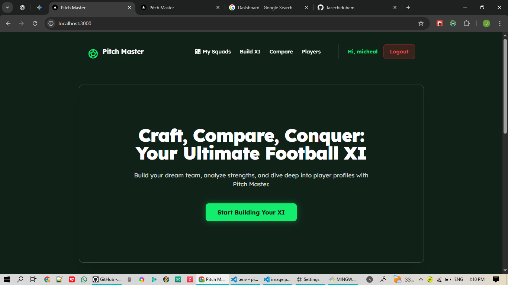
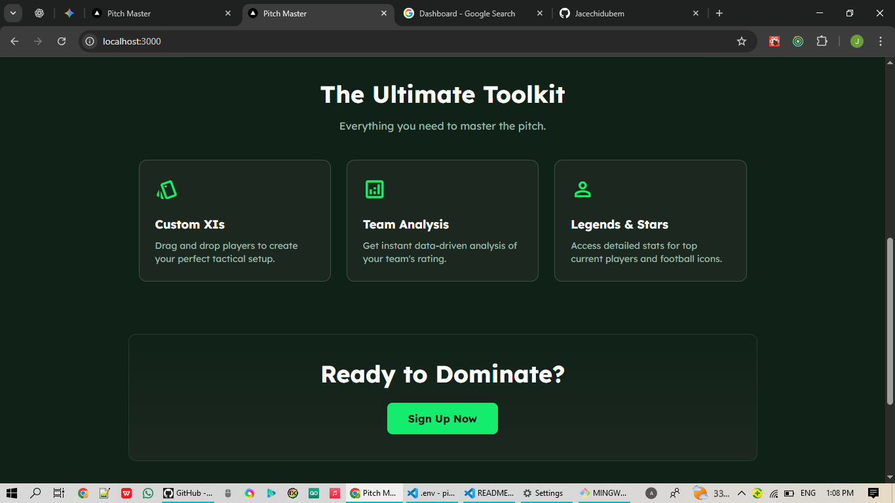

# ⚽ Pitch Master - Ultimate Squad Builder

Pitch Master is a full-stack MERN application that allows football enthusiasts to build their dream team, analyze tactical strengths, and simulate head-to-head matchups against other squads.

![Pitch Master Screenshot] 



## 🚀 Features

* **🏆 Squad Builder:** Drag & Drop interface to place players on a dynamic pitch.
* **📊 Real-Time Analysis:** Instant algorithmic feedback on your team's Attack, Midfield, and Defense ratings.
* **🧠 The "Coach" Logic:** An AI-style commentator that generates verdicts (e.g., "World Class", "Glass Cannon") based on your stats.
* **⚔️ Head-to-Head Simulation:** Compare two saved squads with a Radar Chart visualization and a predicted winner.
* **📂 Database of Legends:** Includes 200+ players including Icons (Pele, Zidane) and current stars.
* **🔐 Secure Auth:** Full JWT Authentication (Register/Login).

## 🛠️ Tech Stack

**Frontend:**
* React.js (Vite/CRA)
* Redux Toolkit (State Management)
* Tailwind CSS (Styling)
* React DnD (Drag and Drop)
* Chart.js (Data Visualization)

**Backend:**
* Node.js & Express.js
* MongoDB & Mongoose
* JWT (JSON Web Tokens)

## 📦 Installation & Setup

1.  **Clone the repository**
    ```bash
    git clone [https://github.com/YOUR_USERNAME/pitch-master.git](https://github.com/YOUR_USERNAME/pitch-master.git)
    cd pitch-master
    ```

2.  **Install Dependencies**
    * **Server:**
        ```bash
        cd server
        npm install
        ```
    * **Client:**
        ```bash
        cd client
        npm install
        ```

3.  **Environment Variables**
    Create a `.env` file in the `server` folder and add:
    ```env
    NODE_ENV=development
    PORT=5000
    MONGO_URI=your_mongodb_connection_string
    JWT_SECRET=your_secret_key
    ```

4.  **Run the App**
    * **Server:** `cd server` -> `npm run dev`
    * **Client:** `cd client` -> `npm start`

## 👨‍💻 Developer

**Enyinnia Joseph C.**
* [GitHub Profile](https://github.com/Jacechidubem)